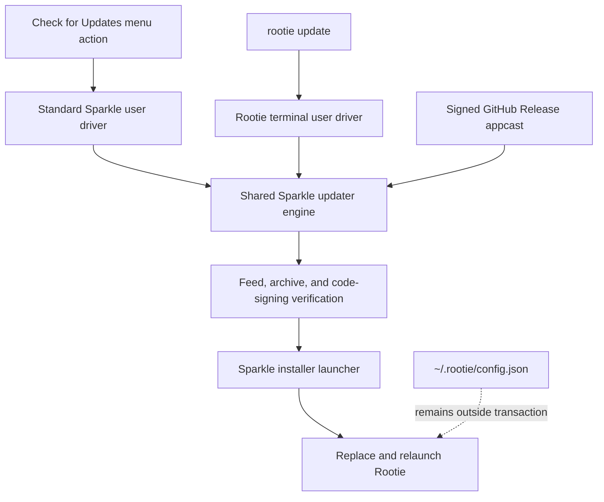
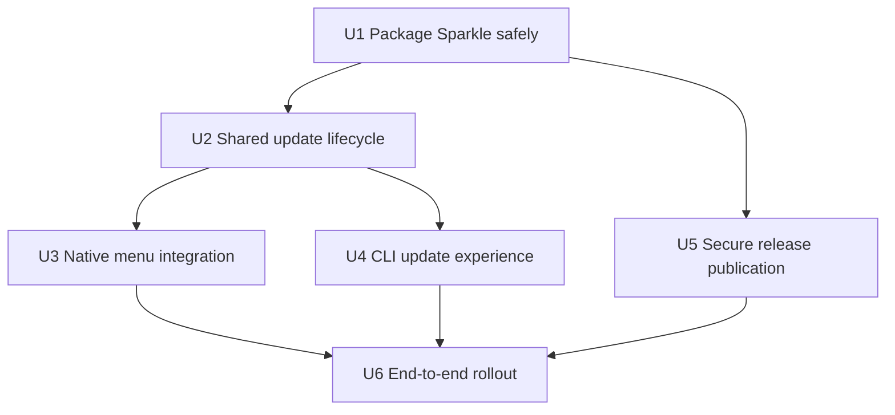

# feat: Add Sparkle-powered Rootie updates

## Summary

Integrate Sparkle 2 as Rootie's single update engine, expose it through native
menu-bar and terminal-specific presentation, and harden the GitHub release
pipeline so every offered update is ad-hoc code-signed, appcast-fed, and EdDSA
verified. Homebrew remains an installation channel but opts into the
standard self-updating cask model rather than receiving a separate code path.

---

## Problem Frame

Rootie currently publishes an ad-hoc-signed ZIP and leaves users to choose the
right reinstall or Homebrew command. A built-in updater must safely replace a
running macOS app, communicate the same outcomes through two interfaces, and
avoid creating competing ownership semantics for Homebrew installs (see origin:
`docs/brainstorms/2026-09-14-built-in-updates-requirements.md`).

The first Sparkle-enabled version is necessarily a bootstrap release: existing
v0.4.0 installations do not contain an updater and must receive that version
through the current Homebrew or manual installation path once. All later
versions can use the built-in flow.

---

## Requirements

- R1. Provide a user-triggered `rootie update` command.
- R2. Provide a user-triggered **Check for Updates…** menu action.
- R3. Both entry points show installed/latest versions and release notes before
  requesting approval.
- R4. Installation requires explicit approval; cancellation changes nothing.
- R5. Sparkle handles both Homebrew and manual installations, with the Homebrew
  cask declaring `auto_updates true`.
- R6. GitHub-hosted updates are ad-hoc code-signed and verified by Sparkle using
  EdDSA before replacement; configuration remains outside the app transaction
  and Rootie relaunches after success when it was running.
- R7. Replacement failures retain or restore a working prior installation and
  surface an actionable error.
- R8. Both interfaces distinguish current, available, cancelled, offline,
  invalid-feed, verification-failed, install-failed, and successful outcomes.
- R9. Sparkle performs no periodic checks, automatic downloads, or silent
  background installations.

**Origin actors:** A1 (Rootie user), A2 (Rootie), A3 (GitHub Releases/Sparkle
release provider)

**Origin flows:** F1 (CLI update), F2 (menu-bar update)

**Origin acceptance examples:** AE1 (Homebrew-installed update), AE2
(cancellation), AE3 (manual-install update), AE4 (invalid signature), AE5
(already current), AE6 (offline)

### Interface behavior matrix

| State | Menu bar | CLI | Installation effect |
|---|---|---|---|
| Current | Sparkle's native current-version result | Terminal current-version result | None |
| Available | Native versions, notes, and confirmation | Terminal versions, notes, and confirmation | None until approved |
| Cancelled | Native cancellation/dismissal | Successful cancellation status | None |
| Offline or invalid feed | Native actionable error | Non-zero status with actionable error | None |
| Verification/install failure | Native Sparkle error | Non-zero status with mapped Sparkle error | Prior app remains usable |
| Success | Relaunched updated menu app | Terminal completes after Sparkle hands off installation | Verified app replaces prior app |

---

## Scope Boundaries

- No custom downloader, version comparator, app replacement helper, rollback
  transaction, or Homebrew ownership detector.
- No `brew upgrade` subprocess path; Sparkle updates the stable app bundle path
  for every installation origin.
- No periodic update checks, automatic downloads, telemetry, update channels,
  prereleases, downgrade flow, critical-update policy, or delta updates in v1.
- No changes to routing decisions, browser/profile discovery, or
  `~/.rootie/config.json` storage.
- Agent Skill updates remain separate through `npx skills update`.

### Deferred to Follow-Up Work

- Existing `scripts/install-release.sh` download hardening: improve the
  bootstrap/manual installer independently; it is not part of Sparkle's
  post-bootstrap update transaction.
- Delta updates: consider only if full universal archives become large enough to
  justify retaining release history for delta generation.

---

## Context & Research

### Relevant Code and Patterns

- `Sources/Rootie/RootieApp.swift` selects synchronous CLI execution or the
  accessory AppKit lifecycle; the update command needs an asynchronous run-loop
  boundary without changing ordinary commands.
- `Sources/Rootie/RootieCLI.swift` uses injected input/output closures and stable
  exit-code conventions. Its bundle locator already resolves a Homebrew command
  symlink back to `Rootie.app`.
- `Sources/Rootie/AppDelegate.swift` constructs the menu programmatically and
  uses modal native feedback; Sparkle's standard updater controller should own
  update UI rather than duplicating those alerts.
- `Tests/RootieTests/RootieCLITests.swift` uses Swift Testing and injected
  collaborators, including coverage for a CLI symlink resolving into an app
  bundle.
- `scripts/build-app.sh` hand-assembles the bundle and ad-hoc signs it. Sparkle's
  framework, helper services, runpath, nested signatures, hardened runtime, and
  signatures must be added deliberately because there is no Xcode archive step.
- `.github/workflows/release.yml` is the existing tag-triggered source of GitHub
  release archives and generated notes.
- `Resources/Info.plist` currently keeps `CFBundleVersion` fixed at `1`; Sparkle
  requires an incrementing machine-readable build version in addition to the
  display version.
- The current Homebrew installation links both the Caskroom app entry and
  `/opt/homebrew/bin/rootie` to the stable `/Applications/Rootie.app` path, so a
  Sparkle replacement preserves command resolution.

### Institutional Learnings

- No `docs/solutions/`, `AGENTS.md`, or `CLAUDE.md` guidance exists.
- `CONTRIBUTING.md` favors keeping core behavior independent of AppKit and adding
  tests for new behavior. Update state mapping and terminal presentation should
  therefore remain testable without native alert automation.

### Prior Art

- Kit Langton's Hex integrates Sparkle through Swift Package Manager, uses an
  `SPUStandardUpdaterController` for **Check for Updates…**, publishes a signed
  appcast, ships signed/notarized artifacts, and declares `auto_updates true` in
  its official Homebrew cask.
- Rootie PR #6 established the current CLI and Homebrew symlink/version patterns
  that this work must preserve.

### External References

- [Sparkle basic setup and security](https://sparkle-project.org/documentation/)
- [Sparkle programmatic setup](https://sparkle-project.org/documentation/programmatic-setup/)
- [Sparkle custom user interfaces](https://sparkle-project.org/documentation/custom-user-interfaces/)
- [Sparkle publishing](https://sparkle-project.org/documentation/publishing/)
- [Sparkle command-line utility](https://sparkle-project.org/documentation/sparkle-cli/)
- [Homebrew `auto_updates` cask stanza](https://docs.brew.sh/Cask-Cookbook#stanza-auto_updates)
- [GitHub immutable releases](https://docs.github.com/en/code-security/concepts/supply-chain-security/immutable-releases)

---

## Key Technical Decisions

| Decision | Rationale |
|---|---|
| Use a pinned Sparkle 2 SwiftPM dependency | Reuses maintained appcast parsing, verification, installer authorization, replacement, rollback, and relaunch behavior. |
| Use Sparkle for every installation origin | Matches Homebrew's supported self-updating cask convention and avoids ownership detection or competing update implementations. |
| Use Sparkle's standard native driver and a Rootie terminal user driver | Both surfaces share the updater engine and state while presenting interaction appropriate to their environment. |
| Host a signed appcast and update assets in GitHub Releases | Keeps GitHub authoritative and avoids introducing S3 or another hosted service. A stable latest-release URL points clients at the current appcast. |
| Require archive and feed signing | EdDSA authenticates executable bytes; signed-feed verification also protects versions and release notes shown before approval. |
| Keep automatic checks disabled in bundle configuration | Makes user-trigger-only behavior the invariant for fresh installs and avoids Sparkle's second-launch permission prompt/default schedule. |
| Retain ad-hoc app signing | Avoids an Apple Developer Program dependency. Sparkle EdDSA authenticates update metadata and bytes, while Homebrew retains the quarantine workaround; Rootie does not claim Developer ID or notarization assurance. |
| Derive display and build versions from the release tag/run | Sparkle compares `CFBundleVersion`; leaving every release at build `1` would prevent reliable update ordering. |

---

## Open Questions

### Resolved During Planning

- **How are Homebrew installations recognized?** They are not. The cask opts
  into self-updating behavior and its stable app/CLI symlinks survive bundle
  replacement.
- **Who owns replacement and rollback?** Sparkle's updater and installer
  launcher; Rootie does not implement a helper transaction.
- **Where does update metadata live?** A signed appcast attached to the latest
  immutable GitHub Release, with enclosures and release notes referring to
  assets from that same release.
- **How are release notes presented?** Markdown carried by the appcast is shown
  by Sparkle's standard UI and converted into readable terminal output by the
  CLI driver.

### Deferred to Implementation

- **Exact Sparkle callback-to-state mapping:** finalize against the pinned
  Sparkle version's public protocols while implementing the thin adapter; do not
  parse localized Sparkle error text.
- **Hand-built bundle artifact location:** confirm the SwiftPM binary artifact
  path during implementation and encapsulate it in the build script rather than
  depending on undocumented user-specific cache paths.
- **CLI installation handoff timing:** validate with a packaged old/new pair
  whether the terminal process can report final success before replacement or
  must report a successful handoff immediately before Sparkle terminates it.
  Either behavior must avoid claiming that installation succeeded before
  Sparkle has accepted the verified transaction.

---

## High-Level Technical Design

> *This illustrates the intended approach and is directional guidance for
> review, not implementation specification. The implementing agent should treat
> it as context, not code to reproduce.*



Release publication is ordered so no client can observe an installable appcast
entry before its signed enclosure exists. The first updater-aware
release is installed through the old path; its appcast offers only a later test
or production release.

---

## Implementation Units



### U1. Package Sparkle in Rootie.app

**Goal:** Add a pinned Sparkle dependency and produce a locally runnable bundle
whose framework and helper components are embedded with valid loader paths and
signatures.

**Requirements:** R6, R7, R9

**Dependencies:** A protected Sparkle EdDSA key is required for release
verification.

**Files:**
- Modify: `Package.swift`
- Create: `Package.resolved`
- Modify: `scripts/build-app.sh`
- Modify: `Resources/Info.plist`
- Create: `Tests/RootieTests/UpdateBundleConfigurationTests.swift`

**Approach:**
- Pin a stable Sparkle 2 release rather than tracking a branch.
- Extend the hand-built bundle to preserve and embed Sparkle's framework
  symlinks, establish the executable runpath, and sign nested code in the order
  required by macOS.
- Keep a clearly separated local build mode and distribution mode. Both remain
  ad-hoc code-signed; release mode additionally requires explicit version/build
  metadata and hardened runtime.
- Add static Sparkle configuration for the GitHub appcast URL, public EdDSA key,
  signed-feed/pre-extraction verification, a disabled signed-feed expiry
  fallback, and disabled automatic checks/downloads.
- Keep sandbox-only installer/downloader XPC services disabled; Rootie is a
  non-sandboxed app and uses Sparkle's normal external installer path.
- Replace fixed build numbering with release-provided values while retaining
  `CFBundleShortVersionString` as the user-facing semantic version.

**Execution note:** Establish bundle-configuration tests before changing the
packaging script, then verify the assembled artifact as an integration outcome.

**Patterns to follow:**
- Existing universal build and explicit bundle assembly in
  `scripts/build-app.sh`.
- Existing bundle identifier and macOS 13 deployment target in
  `Resources/Info.plist`.
- Sparkle's non-Xcode embedding and security guidance.

**Test scenarios:**
- Happy path: a configured test bundle exposes the expected feed URL, public
  key, signed-feed settings, and user-trigger-only settings.
- Edge case: development metadata remains locally buildable without release
  version inputs.
- Error path: distribution packaging without the Sparkle key, public update key,
  or valid incrementing build version fails before producing a release archive.
- Integration: the assembled universal app contains Sparkle under
  `Contents/Frameworks`, resolves its runtime dependency, preserves framework
  symlinks, and passes strict code-signature verification.

**Verification:**
- A locally assembled Rootie launches with Sparkle linked.
- A distribution artifact passes bundle, architecture, runpath, nested
  code-signature, and Sparkle signature inspection.

### U2. Introduce a shared update lifecycle adapter

**Goal:** Give native and terminal entry points one testable Rootie-facing
update lifecycle without reimplementing Sparkle's update engine.

**Requirements:** R3, R4, R6, R7, R8, R9; F1, F2

**Dependencies:** U1

**Files:**
- Create: `Sources/Rootie/UpdateCoordinator.swift`
- Create: `Sources/Rootie/UpdateOutcome.swift`
- Create: `Tests/RootieTests/UpdateCoordinatorTests.swift`

**Approach:**
- Keep Rootie's abstraction thin: start a user-initiated check, expose
  interface-neutral outcomes, and map documented Sparkle result/error domains.
- Let Sparkle own feed parsing, version comparison, download, signature and
  code-sign validation, installation, rollback, and relaunch.
- Inject the updater boundary in tests so offline, invalid feed, failed
  verification, failed install, cancellation, and success can be exercised
  without network access or filesystem replacement.
- Do not persist update state in `ConfigStore`; transient updater state belongs
  to the invocation and Sparkle's own preferences.

**Patterns to follow:**
- Closure/protocol injection used by `RootieCLI` and `DefaultBrowserSetter`.
- Foundation-only core behavior requested by `CONTRIBUTING.md`; AppKit-specific
  rendering remains in U3.

**Test scenarios:**
- Covers AE2. Available update followed by cancellation returns cancelled and
  never begins installation.
- Covers AE5. No newer appcast item maps to current, including an installed
  build newer than the feed.
- Covers AE6. Feed transport failure maps to offline and retains the underlying
  actionable detail.
- Covers AE4. Invalid feed signature and invalid archive signature map to
  distinct invalid-feed and verification-failed outcomes.
- Error path: installer authorization denial or replacement failure maps to
  install-failed rather than success.
- Happy path: accepted update progresses from available to a successful
  installation handoff/relaunch outcome exactly once.
- Edge case: a second check while one is active is rejected or disabled without
  creating a second updater session.

**Verification:**
- Both presentation layers can consume the same complete outcome vocabulary.
- Tests prove Rootie never bypasses Sparkle or starts installation before
  affirmative consent.

### U3. Add the native menu update experience

**Goal:** Connect **Check for Updates…** to Sparkle's maintained native user
interface without blocking Rootie's routing lifecycle.

**Requirements:** R2, R3, R4, R6, R7, R8, R9; F2; AE1-AE6

**Dependencies:** U2

**Files:**
- Modify: `Sources/Rootie/AppDelegate.swift`
- Create: `Sources/Rootie/NativeUpdater.swift`
- Create: `Tests/RootieTests/NativeUpdaterTests.swift`

**Approach:**
- Give the app delegate a long-lived standard Sparkle updater controller and
  connect the menu action to a user-initiated check.
- Bind menu availability to Sparkle's ability to check so duplicate checks are
  unavailable while an updater session is active.
- Use Sparkle's standard release-note, current-version, authorization, error,
  installation, and relaunch UI instead of recreating alerts in
  `AppDelegate`.
- Ensure initialization does not opt users into automatic checks and does not
  issue network activity on launch.

**Patterns to follow:**
- Programmatic menu construction and explicit item targets in
  `Sources/Rootie/AppDelegate.swift`.
- Sparkle's programmatic `SPUStandardUpdaterController` integration.

**Test scenarios:**
- Happy path: selecting the menu item starts exactly one user-initiated check.
- Edge case: the menu item is disabled while Sparkle reports it cannot check.
- Covers AE2. Cancelling native confirmation does not request installation.
- Covers AE5 / AE6. Current and offline outcomes are delegated to the standard
  user driver and do not alter Rootie's routing status/configuration.
- Integration: app launch and idle time produce no feed request; only selecting
  the menu item initiates one.
- Integration: after Sparkle relaunches Rootie, the menu app returns to Ready and
  routes links using the pre-update configuration.

**Verification:**
- The menu action presents Sparkle's native installed/latest versions, Markdown
  release notes, confirmation, progress, and terminal result states.
- Rootie remains an accessory/menu-bar app and routing behavior is unchanged.

### U4. Add the terminal update experience

**Goal:** Make `rootie update` run the same Sparkle engine with terminal output,
confirmation, and meaningful exit behavior.

**Requirements:** R1, R3, R4, R6, R7, R8, R9; F1; AE1-AE6

**Dependencies:** U2

**Files:**
- Create: `Sources/Rootie/CLIUpdateDriver.swift`
- Modify: `Sources/Rootie/RootieCLI.swift`
- Modify: `Sources/Rootie/RootieApp.swift`
- Modify: `Tests/RootieTests/RootieCLITests.swift`
- Create: `Tests/RootieTests/CLIUpdateDriverTests.swift`

**Approach:**
- Add `update` to CLI dispatch/help and introduce a dedicated asynchronous
  lifecycle so ordinary CLI commands remain synchronous.
- Implement Sparkle's user-driver boundary for terminal presentation: print the
  installed/latest display versions and readable Markdown notes, accept only an
  affirmative installation response, report progress sparingly, and map final
  outcomes to stable process statuses.
- Resolve the host application from the existing symlink-aware app locator so
  Homebrew's `rootie` command updates `/Applications/Rootie.app` rather than a
  Caskroom receipt path.
- Keep network, parsing, verification, and installation inside Sparkle. Do not
  shell out to Homebrew or parse the appcast separately.
- Bound the CLI run loop to the active update session and ensure interruption or
  end-of-input is cancellation, not implicit consent.

**Execution note:** Build the terminal driver against a fake updater lifecycle
first, then prove the packaged Sparkle handoff with an old/new app pair before
finalizing success timing.

**Patterns to follow:**
- `RootieCLI`'s injected `readInput`, `output`, and `errorOutput` closures.
- Existing exit convention: success/current/cancelled are non-error outcomes;
  malformed invocation uses usage status; update/feed/install failures are
  operational errors.
- Existing symlink bundle-resolution test in
  `Tests/RootieTests/RootieCLITests.swift`.

**Test scenarios:**
- Covers AE1 / AE3. An available update prints installed/latest versions and
  notes, affirmative input authorizes Sparkle, and the completion status reflects
  successful installation handoff.
- Covers AE2. Empty input, EOF, or a non-affirmative response cancels without
  invoking installation and exits successfully.
- Covers AE5. Current version prints a concise current result, does not prompt,
  and exits successfully.
- Covers AE6. Offline checking prints an actionable error to stderr and exits
  non-zero without prompting.
- Covers AE4. Feed-signature, archive-signature, and install failures produce
  distinguishable messages and non-zero outcomes without claiming success.
- Edge case: extra `update` arguments are rejected as usage errors.
- Edge case: invoking through a PATH symlink targets the containing app bundle;
  a development executable with no app bundle reports an actionable unsupported
  context instead of updating an arbitrary path.
- Integration: a packaged old app invoked through its CLI symlink checks a test
  feed, prompts once, installs a signed newer app, preserves the symlink target,
  and relaunches the menu app.

**Verification:**
- `rootie update` satisfies every R8 state without native dialogs except an OS
  authorization prompt when Sparkle requires one.
- CLI and menu use the same feed, updater engine, and verification policy.

### U5. Publish signed GitHub appcasts and archives

**Goal:** Turn a version tag into an immutable GitHub Release that Sparkle can
consume without exposing a partially published or unverifiable update.

**Requirements:** R3, R6, R7, R8, R9; A3

**Dependencies:** U1; protected Sparkle private key; repository immutable-release
setting

**Files:**
- Modify: `.github/workflows/release.yml`
- Create: `scripts/package-release.sh`
- Create: `scripts/verify-release.sh`
- Modify: `scripts/build-app.sh`
- Create: `Tests/RootieTests/ReleaseMetadataTests.swift`

**Approach:**
- Keep private Sparkle key material out of the app, artifacts, and logs.
- Derive display/build versions from the tag and CI run, build the universal app,
  ad-hoc sign with hardened runtime, archive with symlink-preserving tooling, and
  validate before publication.
- Generate release notes once through GitHub's release-note generation API and
  use the same Markdown for the GitHub Release and Sparkle presentation.
- Use Sparkle's official tools to sign the archive and generate/sign the appcast.
  The appcast enclosure points to the versioned GitHub Release archive and
  contains compatible macOS/version metadata.
- Publish the enclosure, release notes, and appcast together, then expose the
  release as latest only after all verification gates pass. Configure the app to
  consume a stable `releases/latest/download/appcast.xml` URL.
- Retain the ordinary SHA-256 GitHub/Homebrew digest as channel metadata, while
  treating Sparkle EdDSA as the built-in updater authenticity boundary.

**Patterns to follow:**
- Tag-triggered release ownership in `.github/workflows/release.yml`.
- Sparkle's `generate_appcast`/`sign_update` tooling rather than hand-authored
  appcast XML.
- Existing `ditto --keepParent` archive layout, extended to preserve Sparkle's
  framework links and resource forks.

**Test scenarios:**
- Happy path: a tagged release produces matching display/build versions, a
  universal archive, release notes, and a signed appcast referencing the exact
  uploaded asset.
- Error path: a missing Sparkle key, invalid bundle signature, archive signature,
  or appcast signature stops publication.
- Edge case: a tag whose version is malformed or does not match bundle metadata
  is rejected before upload.
- Edge case: appcast enclosure URLs, lengths, versions, and minimum macOS values
  are validated against the actual artifact.
- Integration: Sparkle can verify the published feed and archive from an older
  Rootie build before the release is announced as production-ready.

**Verification:**
- A release artifact passes strict nested code-signature checks, universal
  architecture checks, and Sparkle signature checks.
- No release becomes the latest feed source until its complete update chain is
  downloadable and internally consistent.

### U6. Prove and document the bootstrap rollout

**Goal:** Validate both installation origins end to end, update the public
instructions, and make the one-time bootstrap boundary explicit.

**Requirements:** R1-R9; F1, F2; AE1-AE6

**Dependencies:** U3, U4, U5; a newer signed test release; coordinated Homebrew
tap change to `auto_updates true`

**Files:**
- Modify: `README.md`
- Modify: `SECURITY.md`
- Modify: `CONTRIBUTING.md`
- Create: `docs/updater-release-runbook.md`

**Approach:**
- Update install/update documentation to point both Homebrew and manual users at
  `rootie update` or **Check for Updates…** after the bootstrap release.
- Explain that update checks contact GitHub only when requested, and distinguish
  this from Rootie's local handling of URLs/profile metadata.
- Record signing key custody, required CI secrets, build-number rules, appcast
  generation, immutable-release ordering, smoke-test expectations, rollback by
  publishing a corrected higher version, and key-rotation considerations.
- Coordinate the external Homebrew tap cask change to `auto_updates true` before
  advertising the built-in updater.
- Exercise a matrix covering `/Applications` Homebrew installs and manual
  installs in both `/Applications` and `~/Applications`, including writable,
  authorization-required, offline, cancelled, and invalid-signature cases.

**Patterns to follow:**
- Existing concise install and CLI sections in `README.md`.
- Existing privacy language in `SECURITY.md`, amended narrowly for explicit
  update checks rather than generalized telemetry language.

**Test scenarios:**
- Covers AE1. A Homebrew bootstrap install updates through both entry points and
  leaves the app and command symlinks resolving to the updated bundle.
- Covers AE2. Cancellation from each interface leaves bundle/config checksums
  unchanged.
- Covers AE3. A manual install in each supported Applications directory updates,
  preserves `~/.rootie/config.json`, and relaunches.
- Covers AE4. A deliberately invalidly signed archive is rejected before
  replacement from both interfaces.
- Covers AE5 / AE6. Current and offline checks provide clear interface-specific
  results without filesystem changes.
- Error path: authorization denial and simulated install failure leave the prior
  app launchable and provide a manual-download fallback.
- Bootstrap: v0.4.0 cannot self-update; installing the first Sparkle-enabled
  release through Homebrew/current manual instructions enables all subsequent
  built-in updates.

**Verification:**
- The complete matrix is recorded in the runbook with evidence from signed test
  releases, not local fixtures alone.
- Documentation, app behavior, release assets, and Homebrew metadata describe
  one consistent ownership model.

---

## System-Wide Impact

```mermaid
flowchart TB
    Actions[GitHub Actions] --> Release[Immutable GitHub Release]
    Release --> Sparkle[Sparkle engine in Rootie.app]
    Menu[Menu-bar UI] --> Sparkle
    CLI[Rootie CLI] --> Sparkle
    Sparkle --> Bundle[/Applications or ~/Applications bundle]
    Brew[Homebrew cask and command symlink] --> Bundle
    Bundle --> Config[Existing external configuration]
```

- **Interaction graph:** Git tags drive signed release assets/appcast; menu and
  CLI drivers initiate the same Sparkle engine; Sparkle replaces the app bundle;
  LaunchServices relaunches it; Homebrew and CLI links continue targeting the
  stable destination.
- **Error propagation:** Sparkle errors are mapped through a small shared outcome
  layer, then rendered natively or in the terminal. Release-pipeline errors fail
  closed before publication.
- **State lifecycle risks:** Duplicate checks are disabled; automatic check state
  is forced off; no updater state enters Rootie's config; archive/appcast
  publication is ordered to avoid clients observing incomplete releases.
- **API surface parity:** Menu and CLI use one feed and engine but separate user
  drivers. README, help text, privacy documentation, and the external Homebrew
  cask must describe the same behavior.
- **Integration coverage:** Unit tests cannot prove framework embedding,
  signature continuity, authorization, process replacement,
  symlink continuity, or relaunch; U5/U6 provide packaged end-to-end evidence.
- **Unchanged invariants:** URL routing remains local; config remains at
  `~/.rootie/config.json`; existing CLI commands and exit behavior remain
  unchanged; no update network request occurs without an explicit user action.

---

## Dependencies / Prerequisites

- A generated Sparkle EdDSA keypair, with the private key stored as a protected
  CI secret and backed up outside GitHub; only the public key enters the app.
- GitHub immutable releases enabled for the repository before publishing the
  first appcast consumed in production.
- An external change to the Homebrew tap setting `auto_updates true` coordinated
  with the first Sparkle-enabled release.
- Two sequential signed prerelease/test versions to prove a real update before
  production rollout.

---

## Risk Analysis & Mitigation

| Risk | Likelihood | Impact | Mitigation |
|---|---|---|---|
| Hand-built SwiftPM app omits or damages Sparkle framework/helper symlinks | Medium | High | Verify bundle layout, runpaths, strict nested signatures, and launch behavior before updater work proceeds. |
| CLI custom user driver cannot safely report after its containing bundle is replaced | Medium | Medium | Gate U4 on a packaged old/new integration test; report an accepted installation handoff rather than an unproven final success if process termination is required. |
| Existing ad-hoc users expect the first built-in update to work | High | Medium | Document and announce the one-time bootstrap update clearly; test from the first signed updater-aware version onward. |
| Ad-hoc signing provides no Apple-verified identity or notarization | High | Medium | State the limitation clearly, retain Homebrew's quarantine workaround, document manual Gatekeeper approval, and rely on Sparkle EdDSA for update authenticity. |
| Feed is visible before its enclosure or notes are downloadable | Low | High | Stage and validate all artifacts before publishing the release as latest; use immutable releases. |
| Sparkle private key is lost or compromised | Low | High | Protected least-privilege secret, offline backup, documented rotation path, and no private material in artifacts/logs. |
| Homebrew later reinstalls an older cask version | Low | Medium | Mark the cask `auto_updates true`, coordinate cask bumps with releases, and smoke-test normal and greedy Homebrew upgrade behavior. |
| Automatic network activity is accidentally enabled by Sparkle defaults | Medium | High | Encode opt-out settings in `Info.plist` and verify idle launches generate no update request. |
| GitHub `latest` semantics expose a prerelease/draft unexpectedly | Low | Medium | Publish appcasts only on immutable production releases and validate the resolved feed in the release gate. |

---

## Phased Delivery

### Phase 1: Trust and packaging foundation

- Complete U1 and the signing-key prerequisite.
- Produce an updater-aware bootstrap artifact that does not yet
  advertise an installable newer update.

### Phase 2: User-facing update clients

- Complete U2-U4 with fake-updater coverage and local packaged integration.
- Confirm both interfaces remain strictly user-triggered.

### Phase 3: Publication and controlled rollout

- Complete U5, publish two signed test versions, and prove real replacement.
- Complete U6, update the Homebrew cask, document bootstrap behavior, and only
  then advertise built-in updates.

---

## Success Metrics

- Every acceptance example passes through both applicable interfaces using a
  signed packaged old/new pair.
- A Homebrew-installed and a manually installed Rootie reach the same latest
  version through Sparkle without changing `~/.rootie/config.json`.
- Idle app launches and ordinary CLI commands make zero update-feed requests.
- CI refuses to publish an unsigned, mismatched, or incomplete update chain.
- After bootstrap, user documentation requires no installation-origin-specific
  update instructions.

---

## Documentation / Operational Notes

- Document that releases remain ad-hoc signed and unnotarized, including the
  Homebrew quarantine workaround and manual Gatekeeper approval path.
- Explain update-only GitHub network access in both README privacy text and
  `SECURITY.md`; no browsing URL, profile, or config data is transmitted.
- Keep a release runbook because appcast/signing mistakes can strand installed
  clients even when ordinary GitHub downloads remain available.
- Do not publish the private Sparkle key or generated secret-bearing config in
  the repository.

---

## Alternative Approaches Considered

- **Custom GitHub client and replacement helper:** rejected because it duplicates
  security-sensitive verification, privilege, rollback, and relaunch machinery
  already maintained by Sparkle.
- **Homebrew adapter plus Sparkle only for manual installs:** rejected because
  Homebrew explicitly supports self-updating casks and Rootie's stable symlinks
  make one update engine viable.
- **Sparkle standard UI for both entry points:** rejected because a CLI command
  must present statuses, notes, confirmation, and errors in the terminal rather
  than unexpectedly switching interfaces.
- **Deploy Sparkle's generic `sparkle-cli`:** retained as implementation
  reference but not the primary interface because it does not satisfy Rootie's
  release-note and confirmation contract without additional presentation.
- **S3 or GitHub Pages appcast hosting:** rejected for v1 because a latest-release
  asset URL keeps all authoritative metadata and binaries under GitHub Releases.

---

## Sources & References

- **Origin document:**
  [`docs/brainstorms/2026-09-14-built-in-updates-requirements.md`](../brainstorms/2026-09-14-built-in-updates-requirements.md)
- Related code: `Sources/Rootie/RootieCLI.swift`
- Related code: `Sources/Rootie/AppDelegate.swift`
- Related code: `scripts/build-app.sh`
- Related release workflow: `.github/workflows/release.yml`
- Related PR: [#6](https://github.com/hmbakhsh/rootie/pull/6)
- Prior art: [kitlangton/Hex](https://github.com/kitlangton/Hex)
- External documentation: links under Context & Research
